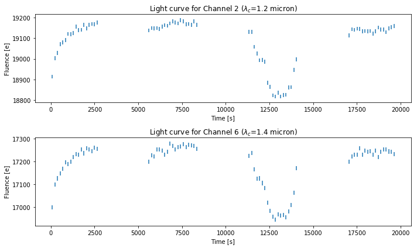
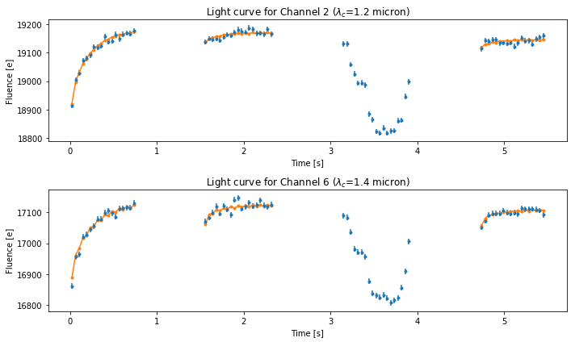
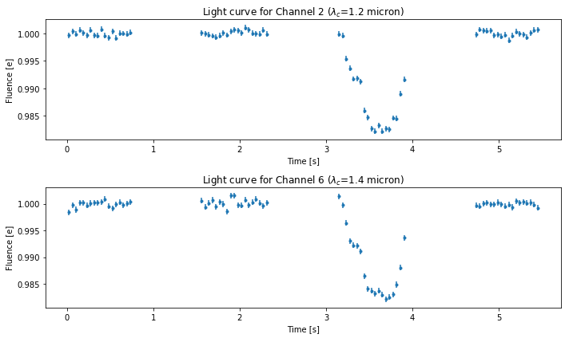

TRAPPIST-1 Demonstration
========================

This is a demonstration of RECTE reduction to remove ramp effect in the
HST light curves. We apply the correction to the TRAPPIST-1 observations
(firstly published in De Wit et al. 2016). The result of this
demosntration is published in Zhang et al. (2018)

Lightcurve Preparations
-----------------------

The light curve for each wavelength channel needs to be extracted from
the observation ima frame before applying the RECTE correction (or any
other types of ramp effect correction). The reference for this
procedures is Deming et al. (2013). Light curves are prepared for this
demonstration and stored in pickle file "".

| We first plot the extracted light curves, without applying any
  correction. The characteristic ramp is visible in every light curve,
  and these ramps have stronger amplitude at the first orbits of the
  observations. We can see some other features in these ligth curves:
| 1. Except for the first orbit light curves, the HST-orbital-variations
  of the ramp systematics are still visible. Comparing the light curves
  for the second orbit and that for the last orbit, the ramp amplitudes
  for the second orbit are stronger. This features shows the process of
  charge trapping lasting through the entire observations, especially
  for a faint host star such as TRAPPIST-1. 2. Channel-variation of the
  the ramp systematics are also visible. TRAPPIST-1, being an M8 star,
  has a signficant 1.4 :math:`\mu`\ m water feature in its 1.1 to 1.7
  :math:`\mu`\ m spectrum. This water feature introduces flux intensity
  variations between channels. From the charge trapping perspective,
  flux intensity variations lead to different charge trapping rate
  between different channels, and thus differnt ramp profiles. RECTE
  model considers these aspects in the corrections and provides a
  physically-motivated solution.

Demonstration of the uncorrected light curves
---------------------------------------------

.. code:: ipython3

    import pickle
    import shelve
    import matplotlib.pyplot as plt
    %matplotlib notebook

.. code:: ipython3

    # restore light curve array from 
    DBFileName = './binned_lightcurves_visit_01.shelve'
    saveDB = shelve.open(DBFileName)
    LCarray = saveDB['LCmat']
    ERRarray = saveDB['Errmat']
    time = saveDB['time']
    wavelength = saveDB['wavelength']
    orbit = saveDB['orbit']
    expTime = saveDB['expTime']

.. code:: ipython3

    # plot light curve of the second channel and the sixth channel
    fig1 = plt.figure(figsize=(10, 6))
    ax1 = fig1.add_subplot(211)
    ax1.errorbar(time, LCarray[1, :], yerr=ERRarray[1, :], ls='none')
    ax1.set_title('Light curve for Channel 2 ($\lambda_c$={0:.2} micron)'.format(wavelength[1]))
    ax1.set_xlabel('Time [s]')
    ax1.set_ylabel('Fluence [e]')
    ax2 = fig1.add_subplot(212)
    ax2.errorbar(time, LCarray[5, :], yerr=ERRarray[5, :], ls='none')
    ax2.set_title('Light curve for Channel 6 ($\lambda_c$={0:.2} micron)'.format(wavelength[6]))
    ax2.set_xlabel('Time [s]')
    ax2.set_ylabel('Fluence [e]')
    fig1.tight_layout()

Now let’s write a function to remove the systemacts from the lightcurves

.. code:: ipython3

    from RECTE import RECTE
    from lmfit import Parameters, Model
    
    def rampProfile2(crate1, slope1, crate2, slope2, dTrap_s, dTrap_f, trap_pop_s,
                     trap_pop_f, tExp, expTime, scanDirect):
        """Ramp profile for bi-directional scan And RECTE model parameters:
    
        :param crate1: average count rate in electron/second for two
        directions
        :param slope1: visit-long slope for two directions
        :param crate2: average count rate in electron/second for two directions
        :param slope2: visit-long slope for two directions
        :param dTrap_s: extra trapped slow charges between orbits
        :param dTrap_f: extra trapped fast charges between orbits
        :param trap_pop_s: initially trapped slow charges
        :param trap_pop_f: initially trapped fast charges
        :param tExp: beginning of each exposure
        :param expTime: exposure time
        :param scanDirect: scan direction (0 or 1) for each exposure
        :returns: observed counts
        :rtype: numpy.array
    
        """
        tExp = (tExp - tExp[0])
        upIndex, = np.where(scanDirect == 0)
        downIndex, = np.where(scanDirect == 1)
        cRates = np.zeros_like(tExp, dtype=float)
        cRates[upIndex] = (crate1 * (1 + tExp * slope1 / 1e7) / expTime)[upIndex]
        cRates[downIndex] = (crate2 *
                             (1 + tExp * slope2 / 1e7) / expTime)[downIndex]
        obsCounts = RECTE(
            cRates,
            tExp,
            expTime,
            trap_pop_s,
            trap_pop_f,
            dTrap_f=[dTrap_f],
            dTrap_s=[dTrap_s],
            dt0=[0],
            lost=0,
            mode='scanning')
        return obsCounts
    
    
    def RECTECorrector2(t, orbits, counts, p, expTime, scanDirect, orbits_inTransit):
        """correct the RECTE model for one directional scan observations
    
        :param t: time stamps of the exposures
        :param orbits: orbit number of the exposures
        :param counts: observed counts
        :param p: Parameters objects to fit
        :param expTime: exposure time
        :param scanDirect: scan direction (0 or 1) for each exposure
        :returns: RECTE profile for correciting the light curve, best fit
        count rate array, RECTE output, slope
        :rtype: tuple of four numpy array
    
        """
        upIndex, = np.where(scanDirect == 0)
        downIndex, = np.where(scanDirect == 1)
        p = p.copy()
        p.add('crate1', value=counts.mean(), vary=True)
        p.add('crate2', value=counts.mean(), vary=True)
        p.add('slope1', value=0, min=-5, max=5, vary=True)
        p.add('slope2', value=0, min=-5, max=5, vary=True)
        rampModel2 = Model(
            rampProfile2, independent_vars=['tExp', 'expTime', 'scanDirect'])
        # model fit, obtain crate, and transit parameter,
        # but ignore transit para for this time
        t0 = t - t[0]  # make the first element in time array 0
        weights = np.ones_like(t)
        # if not inlucde the transit orbit,
        weights[np.in1d(orbits, orbits_inTransit)] = 0
        fitResult = rampModel2.fit(
            counts,
            tExp=t0,
            expTime=expTime,
            scanDirect=scanDirect,
            weights=weights,
            params=p,
            method='powell')
        # m = batman.TransitModel(transit_params, tBJD + 0.5 * expTime / 86400,
        #                         supersample_factor=9, exp_time=expTime/86400)
        counts_fit = np.zeros_like(counts, dtype=float)
        counts_fit[upIndex] = (fitResult.params['crate1'].value * (
            1 + t0 * fitResult.params['slope1'] / 1e7))[upIndex]
        counts_fit[downIndex] = (fitResult.params['crate2'].value * (
            1 + t0 * fitResult.params['slope2'] / 1e7))[downIndex]
        RECTE_out = fitResult.best_fit
        RECTE_in = np.zeros_like(RECTE_out)
        RECTE_in[upIndex] = fitResult.params['crate1'].value * (
            1 + t0[upIndex] * fitResult.params['slope1'] / 1e7)
        RECTE_in[downIndex] = fitResult.params['crate2'].value * (
            1 + t0[downIndex] * fitResult.params['slope2'] / 1e7)
        correctTerm = RECTE_out / RECTE_in
        slopes = np.zeros_like(RECTE_out)
        slopes[upIndex] = 1 + t0[upIndex] * fitResult.params['slope1'] / 1e7
        slopes[downIndex] = 1 + t0[downIndex] * fitResult.params['slope2'] / 1e7
        crates = np.zeros_like(RECTE_out)
        crates[upIndex] = fitResult.params['crate1'] * slopes[upIndex]
        crates[downIndex] = fitResult.params['crate2'] * slopes[downIndex]
        return correctTerm, crates, RECTE_out, slopes
    
    def deRamp(pDeRamp,
               time,
               LCArray,
               ErrArray,
               orbits,
               expTime,
               scanDirect,
               twoDirect=False):
        """
        fit transit models
        deRECTE for a visit
        """
        nLC = LCArray.shape[0]  # number of light curves
        deRampArray = LCArray.copy()
        deRampErrArray = ErrArray.copy()
        modelArray = LCArray.copy()
        crateArray = LCArray.copy()
        slopeArray = LCArray.copy()
        p = pDeRamp.copy()
        for i in range(nLC):
            correctTerm, crate, bestfit, slope = RECTECorrector2(
                time, orbits, LCArray[i, :], p, expTime/1000, scanDirect, np.array([2]))
            deRampArray[i, :] = LCArray[i, :] / correctTerm / (crate)
            deRampErrArray[i, :] = ErrArray[i, :] / correctTerm / (crate)
            modelArray[i, :] = bestfit
            crateArray[i, :] = crate
            slopeArray[i, :] = slope
        return deRampArray, deRampErrArray, modelArray, crateArray, slopeArray

.. code:: ipython3

    import pandas as pd
    import numpy as np
    
    infoFN = './TRAPPIST_Info.csv'
    info = pd.read_csv(infoFN)
    grismInfo = info[info['Filter'] == 'G141']
    scanDirect = grismInfo['ScanDirection'].values
    p = Parameters()
    p.add('trap_pop_s', value=0, min=0, max=200, vary=True)
    p.add('trap_pop_f', value=0, min=0, max=100, vary=True)
    p.add('dTrap_f', value=0, min=0, max=200, vary=True)
    p.add('dTrap_s', value=50, min=0, max=100, vary=True)
    LCarray_noRamp, ERRarray_noRamp, Modelarray, cratearray, slopearray = deRamp(
        p, 
        time, 
        LCarray, 
        ERRarray, 
        orbit, 
        expTime,
        scanDirect)

Now, plot the result

.. code:: ipython3

    fig2 = plt.figure(figsize=(10, 6))
    ax1 = fig2.add_subplot(211)
    
    ax1.errorbar(
        time / 3600,
        LCarray[1, :],
        yerr=ERRarray[1, :],
        fmt='.',
        ls='')
    for o in [0, 1, 3]:
        ax1.plot(
            time[orbit == o] / 3600,
            Modelarray[1, orbit == o],
            '.-',
            color='C1')
    ax1.set_title('Light curve for Channel 2 ($\lambda_c$={0:.2} micron)'.format(wavelength[1]))
    ax1.set_xlabel('Time [s]')
    ax1.set_ylabel('Fluence [e]')
    
    ax2 = fig2.add_subplot(212)
    ax2.errorbar(
        time / 3600,
        LCarray[6, :],
        yerr=ERRarray[6, :],
        fmt='.',
        ls='')
    for o in [0, 1, 3]:
        ax2.plot(
            time[orbit == o] / 3600,
            Modelarray[6, orbit == o],
            '.-',
            color='C1')
    ax2.set_title('Light curve for Channel 6 ($\lambda_c$={0:.2} micron)'.format(wavelength[6]))
    ax2.set_xlabel('Time [s]')
    ax2.set_ylabel('Fluence [e]')
    fig2.tight_layout()

.. code:: ipython3

    fig3 = plt.figure(figsize=(10, 6))
    ax1 = fig3.add_subplot(211)
    
    ax1.errorbar(
        time / 3600,
        LCarray_noRamp[1, :],
        yerr=ERRarray_noRamp[1, :],
        fmt='.',
        ls='')
    ax1.set_title('Light curve for Channel 2 ($\lambda_c$={0:.2} micron)'.format(wavelength[1]))
    ax1.set_xlabel('Time [s]')
    ax1.set_ylabel('Fluence [e]')
    
    ax2 = fig3.add_subplot(212)
    ax2.errorbar(
        time / 3600,
        LCarray_noRamp[6, :],
        yerr=ERRarray_noRamp[6, :],
        fmt='.',
        ls='')
    
    ax2.set_title('Light curve for Channel 6 ($\lambda_c$={0:.2} micron)'.format(wavelength[6]))
    ax2.set_xlabel('Time [s]')
    ax2.set_ylabel('Fluence [e]')
    fig3.tight_layout()

