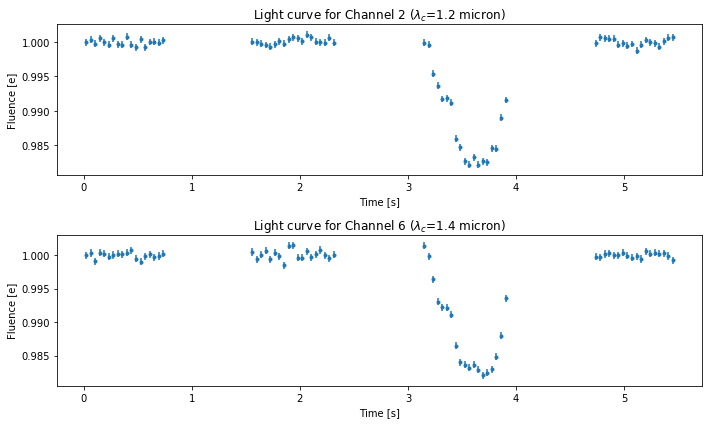

RECTE Demonstrations with TRAPPIST-1 Observations
=================================================

This Jupyter notebook demonstrates how to use RECTE to remove ramp
effect systematics in the HST/WFC3 light curves. We apply RECTE
correction to the TRAPPIST-1 observations (firstly published in De Wit
et al. 2016). Results in this demosntration were published in Zhang et
al. (2018).

Light curve Preparations
------------------------

The light curve for each wavelength channel needs to be extracted from
the observation ima frame before applying the RECTE correction (or any
other types of ramp effect correction). The reference for this
procedures is Deming et al. (2013). Light curves were pre-calculated for
this demonstration and stored in a python shelve file.

| We first plot the extracted light curves, without applying any
  correction. The characteristic ramp is visible in every light curve.
  These ramps have stronger amplitude at the first orbits of the
  observations. We can see some other features in these ligth curves:
| 1. Except for the first orbit light curves, the HST-orbital-variations
  of the ramp systematics are still visible. Comparing the light curves
  for the second orbit and that for the last orbit, the ramp amplitudes
  for the second orbit are stronger. This features shows the process of
  charge trapping lasting through the entire observations, especially
  for a faint host star such as TRAPPIST-1. 2. Channel-variation of the
  the ramp systematics are also visible. TRAPPIST-1, being an M8 star,
  has a signficant 1.4 :math:`\mu`\ m water feature in its 1.1 to 1.7
  :math:`\mu`\ m spectrum. This water feature introduces flux intensity
  variations between channels. From the charge trapping perspective,
  flux intensity variations lead to different charge trapping rate
  between different channels, and thus differnt ramp profiles. RECTE
  model considers these aspects in the corrections and provides a
  physically-motivated solution.

Uncorrected light curves
------------------------

.. code:: python

    import shelve
    import matplotlib.pyplot as plt
    %matplotlib notebook

.. code:: python

    # First, restore light curve array from the shelve file
    DBFileName = './demonstration_data/binned_lightcurves_visit_01.shelve'
    saveDB = shelve.open(DBFileName)
    LCarray = saveDB['LCmat']
    ERRarray = saveDB['Errmat']
    time = saveDB['time']
    wavelength = saveDB['wavelength']
    orbit = saveDB['orbit']
    orbit_transit = np.array([2])  # transit occurs in the third orbits
    expTime = saveDB['expTime']
    saveDB.close()

.. code:: python

    # plot light curve of the second channel and the sixth channel
    fig1 = plt.figure(figsize=(10, 6))
    ax1 = fig1.add_subplot(211)
    ax1.errorbar(time, LCarray[1, :], yerr=ERRarray[1, :], ls='none')
    ax1.set_title('Light curve for Channel 2 ($\lambda_c$={0:.2} micron)'.format(wavelength[1]))
    ax1.set_xlabel('Time [s]')
    ax1.set_ylabel('Fluence [e]')
    ax2 = fig1.add_subplot(212)
    ax2.errorbar(time, LCarray[5, :], yerr=ERRarray[5, :], ls='none')
    ax2.set_title('Light curve for Channel 6 ($\lambda_c$={0:.2} micron)'.format(wavelength[6]))
    ax2.set_xlabel('Time [s]')
    ax2.set_ylabel('Fluence [e]')
    fig1.tight_layout()

.. image:: RECTE_Demonstration_files/RECTE_Demonstration_3_0.png

RECTE corrections
=================

We will use the convenience functions from the ``RECTECorrector`` module
to make corrections. Two functions ``RECTECorrrector1`` and
``RECTECorrector2`` are for corrections for single-directional scanning
or “round-trip” scanning observations, respectively. The observation
used in this demonstration was done using “round-trip” scanning mode.
Therefore, we use ``RECTECorrector2`` function to make the correction.

``RECTECorrector2`` function fits RECTE model profiles to the observed
light curves. It uses ``lmfit`` to perform the optimization. It excludes
the orbits where transits/eclipses occur. But this function can be
easily combined with transit model (such as ``batman``) to include
orbits of transits/eclipses in fitting calculations. ``lmfit`` can also
be changed by MCMC sampler (such as ``emcee``) to return more
informative fitting results.

In the following, we write a wrapper function ``removeRamp`` to get the
systematics-removed light curves

.. code:: python

    from RECTE import RECTE
    from lmfit import Parameters, Model
    from RECTECorrector import RECTECorrector2
    
    def removeRamp(p0,
                   time,
                   LCArray,
                   ErrArray,
                   orbits,
                   orbits_transit,
                   expTime,
                   scanDirect):
        """
        remove Ramp systemetics with RECTE
        
        :param p0: initial parameters
        :param time: time stamp of each exposure
        :param LCArray: numpy array that stores all light curves
        :param ErrArray: light curve uncertainties
        :param orbits: orbit number for each exposure
        :param orbits_transit: orbit number that transits occur. These orbits 
        are excluded in the fit
        :param expTime: exposure time
        :param scanDirect: scanning direction for each exposure. 0 for forward, 
        1 for backward
        """
        nLC = LCArray.shape[0]  # number of light curves
        correctedArray = LCArray.copy()
        correctedErrArray = ErrArray.copy()
        modelArray = LCArray.copy()
        crateArray = LCArray.copy()
        slopeArray = LCArray.copy()
        p = p0.copy()
        for i in range(nLC):
            correctTerm, crate, bestfit, slope = RECTECorrector2(
                time, 
                orbits, 
                orbits_transit, 
                LCArray[i, :], 
                p, 
                expTime, 
                scanDirect)
            # corrected light curve/error are normalized to the baseline
            correctedArray[i, :] = LCArray[i, :] / correctTerm / (crate)
            correctedErrArray[i, :] = ErrArray[i, :] / correctTerm / (crate)
            modelArray[i, :] = bestfit
            crateArray[i, :] = crate
            slopeArray[i, :] = slope
        return correctedArray, correctedErrArray, modelArray, crateArray, slopeArray

.. code:: python

    import pandas as pd
    import numpy as np
    
    infoFN = './demonstration_data/TRAPPIST_Info.csv'
    info = pd.read_csv(infoFN)
    grismInfo = info[info['Filter'] == 'G141']
    scanDirect = grismInfo['ScanDirection'].values
    p = Parameters()
    p.add('trap_pop_s', value=0, min=0, max=200, vary=True)
    p.add('trap_pop_f', value=0, min=0, max=100, vary=True)
    p.add('dTrap_f', value=0, min=0, max=200, vary=True)
    p.add('dTrap_s', value=50, min=0, max=100, vary=True)
    LCarray_noRamp, ERRarray_noRamp, Modelarray, cratearray, slopearray = removeRamp(
        p, 
        time, 
        LCarray, 
        ERRarray, 
        orbit, 
        orbit_transit,
        expTime,
        scanDirect)

Now, ramp systemetics are removed from the observations.

Result plot
-----------

Best-fit Models
~~~~~~~~~~~~~~~

.. code:: python

    fig2 = plt.figure(figsize=(10, 6))
    ax1 = fig2.add_subplot(211)
    
    ax1.errorbar(
        time / 3600,
        LCarray[1, :],
        yerr=ERRarray[1, :],
        fmt='.',
        ls='')
    for o in [0, 1, 3]:
        ax1.plot(
            time[orbit == o] / 3600,
            Modelarray[1, orbit == o],
            '.-',
            color='C1')
    ax1.set_title('Light curve for Channel 2 ($\lambda_c$={0:.2} micron)'.format(wavelength[1]))
    ax1.set_xlabel('Time [s]')
    ax1.set_ylabel('Fluence [e]')
    
    ax2 = fig2.add_subplot(212)
    ax2.errorbar(
        time / 3600,
        LCarray[6, :],
        yerr=ERRarray[6, :],
        fmt='.',
        ls='')
    for o in [0, 1, 3]:
        ax2.plot(
            time[orbit == o] / 3600,
            Modelarray[6, orbit == o],
            '.-',
            color='C1')
    ax2.set_title('Light curve for Channel 6 ($\lambda_c$={0:.2} micron)'.format(wavelength[6]))
    ax2.set_xlabel('Time [s]')
    ax2.set_ylabel('Fluence [e]')
    fig2.tight_layout()

.. image:: RECTE_Demonstration_files/RECTE_Demonstration_8_0.png

Corrected light curves
~~~~~~~~~~~~~~~~~~~~~~

.. code:: python

    fig3 = plt.figure(figsize=(10, 6))
    ax1 = fig3.add_subplot(211)
    
    ax1.errorbar(
        time / 3600,
        LCarray_noRamp[1, :],
        yerr=ERRarray_noRamp[1, :],
        fmt='.',
        ls='')
    ax1.set_title('Light curve for Channel 2 ($\lambda_c$={0:.2} micron)'.format(wavelength[1]))
    ax1.set_xlabel('Time [s]')
    ax1.set_ylabel('Fluence [e]')
    
    ax2 = fig3.add_subplot(212)
    ax2.errorbar(
        time / 3600,
        LCarray_noRamp[6, :],
        yerr=ERRarray_noRamp[6, :],
        fmt='.',
        ls='')
    
    ax2.set_title('Light curve for Channel 6 ($\lambda_c$={0:.2} micron)'.format(wavelength[6]))
    ax2.set_xlabel('Time [s]')
    ax2.set_ylabel('Fluence [e]')
    fig3.tight_layout()

