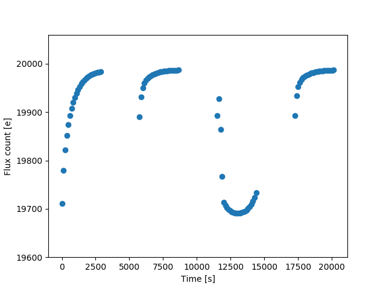

Charge Trapping and Ramp effect in HST/WFC3
===========================================

Following is a demonstration of RECTE, a physically-motivated model for
the charge trapping/ramp effect.

Ramp effect is the most prominent systematics for WFC3/IR detector (as
well as other HgCdTe based detectors) in the time-series observation
mode. It appears as an exponential (:math:`\sim1-\exp(-t)`) shaped light
curve. The typcial amplitude for the ramp is on the order of 1% in the
first orbit and reduces to less than 0.5% for the subsequent orbit. Ramp
effect systematics removal is critical for accurately measuring transit
depths and spectra for transitting exoplanets

In Zhou et al. (2017), we consider the charge trapping processes in the
WFC3/IR detector and created RECTE. The essense of RECTE is that a
fraction of stmulated charges (by incoming radiation) are trapped by in
the detector rather than being detected due to detector defects.

Following demonstration consists of two parts. The first part is to
demonstrate how parameters that descriebe the intrument defects affect
the shape of the ramp. The second part is to demonstrate how parameters
that related to each observation can affect the ramp profile.

.. code:: ipython3

    import ipywidgets as widgets
    from ipywidgets import interactive
    import matplotlib.pyplot as plt
    import numpy as np
    from rampLightCurve import rampModel, rampCorrection
    
    %matplotlib notebook

Charge Trapping Processes
-------------------------

RECTE model assumes two populations of charge traps. The two populations
are distinguished by their typical trapping timescales (:math:`\tau`).
The *slow* traps release the trapped charges at a much longer timescales
than the *fast* traps (:math:`\tau_\mathrm{s} >> \tau_\mathrm{f}`). For
each trap population, the charge trapping processes are controlled by
three parameters (the parameter names used in the python script are in
the parenthesis): \* The numbers of traps (``nTrap_s, nTrap_f``) \*
Trapping efficiencies (``eta_s, eta_f``) \* Trap lifetimes/timescales
(``tau_s, tau_f``)

These parameters determines different aspects of the ramp effect
profiles. Roughly speaking, given a specific fluence intensity, the
numbers of traps determine how fast the ramp rises (fewer traps, faster
rising); trapping efficiencies determine the amplitude of the ramp; trap
lifetimes determine the difference of the observed fluxe between the end
of one orbit and the beginning of the next. Fast traps have stronger
effect at the beginning of each orbits. Slow traps have stronger overall
effect, especially at the latter part of each orbit.

Following script creates an interactive plot that demonstrate how each
model parameter affects the ramp profile. You can adjust these
parameters using the widgets under the plot. The output ramp profile
will change accordingly. You can also change the ``crate`` or
``exptime`` parameter to adjust the fluence rate and exposure time.

.. code:: ipython3

    def rampModelPlot(
        nTrap_s,
        eta_s,
        tau_s,
        nTrap_f,
        eta_f,
        tau_f,
        crate=200,  # electron per second
        exptime=100):
        """plot the ramp model profiles with various model parameters
        
        nTrap: number of traps for slow (_s) and fast (_fast) traps
        eta: trapping efficiencies
        tau: trap lifetimes
        """    
        # rampModel function is made to conveniently change the charge trapping 
        # related parameters
        # This function is not for correction purposes
        lc, t = rampModel(
            nTrap_s,
            eta_s,
            tau_s,
            nTrap_f,
            eta_f,
            tau_f,
            crate,
            exptime
        )
        fig = plt.gcf()
        plt.cla()
        plt.plot(t, lc, 'o')
        plt.xlabel('Time [s]')
        plt.ylabel('Flux count [e]')
        plt.ylim(crate*exptime * 0.98, crate*exptime*1.003)
        plt.draw()
        
    # create interactive widgets
    trap_s = widgets.FloatText(min=1000, max=3000, value=1500, step=100, 
                               description='slow N')
    trap_f = widgets.FloatText(min=50, max=500, value=300, step=50, 
                               description='fast N')
    eta_s = widgets.FloatText(min=0.005, max=0.02, value=0.012, step=0.001, 
                               description='slow eta')
    eta_f = widgets.FloatText(min=0.001, max=0.01, value=0.005, step=0.001, 
                               description='fast eta')
    tau_s = widgets.FloatText(min=6000, max=30000, value=15000, step=2000, 
                               description='slow tau')
    tau_f = widgets.FloatText(min=50, max=500, value=200, step=50, 
                               description='fast tau')
    
    plt.figure()
    
    # make interactive plot
    interactive_plot = interactive(rampModelPlot,
                                   nTrap_s=trap_s,
                                   eta_s=eta_s,
                                   tau_s=tau_s,
                                   nTrap_f=trap_f,
                                   eta_f=eta_f,
                                   tau_f=tau_f,
                                   continuous_update=False)
    
    # adjust details of the plot
    output = interactive_plot.children[-1]
    output.layout.height = '350px'
    # run the interactive plot
    interactive_plot

.. parsed-literal::

    <IPython.core.display.Javascript object>

.. parsed-literal::

    interactive(children=(FloatText(value=1500.0, description='slow N', step=100.0), FloatText(value=0.012, descri…

Ramp Correction Demonstrations
------------------------------

The six parameters described above stays rather constant among different
observations. What determines the ramp profiles are the initial states
of the charge trap status. Additionally trapped charges during the earth
occulation also affects the ramp profiles. The initial stats and
additional trapped charges are controlled by parameters ``trap_pop_s``,
``trap_pop_f``, ``dTrap_s``, and ``dTrap_f``. When correcting ramp
effect in the observed light curves, these parameters need to be fit so
that the model can match the observed light curves.

These parameters can be adjusted in the following intercative plot. This
demontration shows how the model profile changes with the parameters
that are fit during ramp effect corrections.

.. code:: ipython3

    def rampCorrectionPlot(
        trap_pop_s,
        trap_pop_f,
        dTrap_s,
        dTrap_f,
        crate=200,  
        exptime=100): 
        """plot the ramp model profiles with parameters that are used 
            in ramp effect corrections
        
        trap_pop: initial states of the charge traps
        dTrap: added charges during earth occulation
        """
        lc, t = rampCorrection(
            crate,
            exptime,
            trap_pop_s,
            trap_pop_f,
            dTrap_s,
            dTrap_f,
        )
        fig = plt.gcf()
        plt.cla()
        plt.plot(t, lc, 'o')
        plt.xlabel('Time [s]')
        plt.ylabel('Flux count [e]')
        plt.ylim(crate*exptime * 0.98, crate*exptime*1.003)
        plt.draw()
        
    trap_pop_s = widgets.FloatSlider(min=0, max=500, value=50, step=50, 
                               description='slow initial')
    trap_pop_f = widgets.FloatSlider(min=0, max=100, value=10, step=10, 
                               description='fast initial')
    dTrap_s = widgets.FloatSlider(min=0, max=500, value=0, step=50, 
                               description='slow extra')
    dTrap_f = widgets.FloatSlider(min=0, max=100, value=0, step=10, 
                               description='fast extra')
    
    plt.figure()
    interactive_plot = interactive(rampCorrectionPlot,
                                   trap_pop_s=trap_pop_s,
                                   trap_pop_f=trap_pop_f,
                                   dTrap_s=dTrap_s,
                                   dTrap_f=dTrap_f,
                                   continuous_update=False)
    output = interactive_plot.children[-1]
    output.layout.height = '350px'
    interactive_plot

.. parsed-literal::

    <IPython.core.display.Javascript object>

.. parsed-literal::

    interactive(children=(FloatSlider(value=50.0, description='slow initial', max=500.0, step=50.0), FloatSlider(v…

